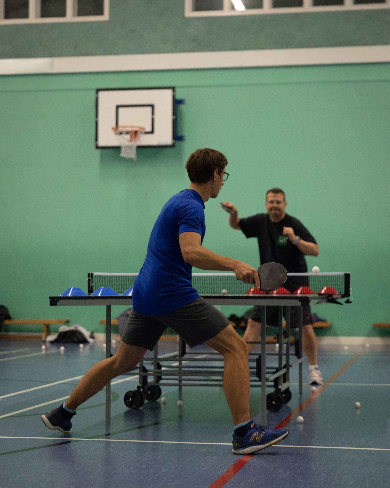

Our weekly sessions are designed to be inclusive of everyone, whether playing leisurely or competitively. Our coach is available to provide advice.

We normally play on a Friday evenings from 5.30pm until 6.45pm (September to April) or from 6pm until 7.30pm (May to August). We sometimes break for half term but we play over the summer. There may be other small variations due to the varying availability of the hall. Please see the table below for the detail. Join the club's WhatsApp group (see the [contact us](contact.qmd) page) for regular reminders and latest updates.

We are open to all adults and motivated, supervised children aged 12 and over. New joiners are welcome to simply turn up at the session of their choice. We can supply all the equipment required, including lending bats. If you have a question before joining, please see the "contact us" page.

| Date | Venue | Time | To note |
| -------- | -------- | -------- | -------- |
| Friday 4 September 2026 | Sports Hall | 5.30pm-6.45pm |
| Friday 11 September 2026 | Sports Hall | 5.30pm-6.45pm |
| Friday 18 September 2026 | Sports Hall | 5.30pm-6.45pm |
| Friday 25 September 2026 | Sports Hall | 5.30pm-6.45pm |

Dates for the autumn will be announced in due course and will follow a similar pattern.

Members go free (see our [membership](membership.qmd) page). We charge £6 per session for non-members. The fee for children under 16 accompanied by a playing adult is £4. We accept card or cash on the door. 

Those attending our sessions regularly are invited to fill this [form](https://docs.google.com/forms/d/e/1FAIpQLSeElvgpaoJbczteYr2RKx2OMc3yo-FwpwUwaxU0pzclbHrW2A/viewform?usp=sf_link).

We are also hoping to hold larger events for the community. To be notified, check options on the [contact us](contact.qmd) page.

{width=500}
